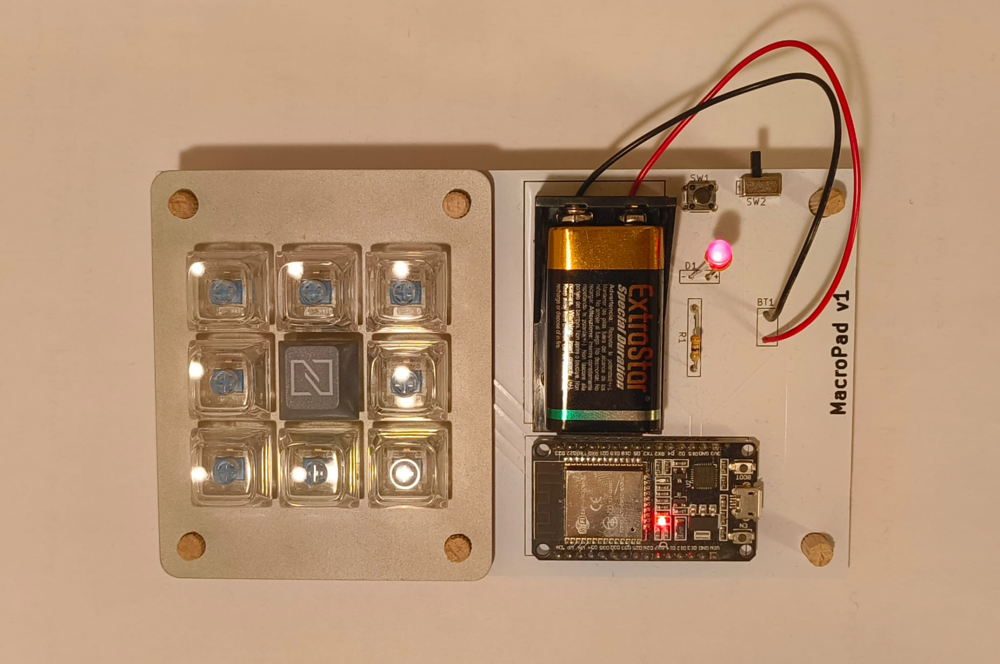

# Introduction
Custom 3x3 MacroPad built with an ESP32. The purpose of the project is to experiment with PCB design and ESP32 programming. The hardware connects via bluetooth to a desktop app designed in Python.

The build is made up of a PCB, a metal frame and 9 MX switches. The electronic components needed are>

* ESP32 DevKit V1 board
* 1 resistor
* 1 LED
* 1 sideways 3-pin switch
* 1 switch
* 1 9V battery

# File structure

* The C code for the ESP32 is located inside the folder "EspCode". Upload this to ESP32 using Arduino IDE.
* The KiCad PCB design files are located inside the folder "KicadFiles". They have been developed in KiCad 9.
* The final PCB schematics, .step file for the metal frame, FreeCad project file for the metal frame and other files used in the design are located in the folder "DesignFiles".
* The code for the desktop app is located in the folder "Python" and "UI".

# Project build

The python app was built into an executable to execute on Windows startup using pyinstaller with the following command:

```

pyinstaller -F --noconsole --icon icon.ico Python\\main.py

```

The final build should look like:



# Usage

The desktop app has a GUI to connect to the macro pad via bluetooth and configure the macros. Currently the macros can be of three types:

* Keyboard shortcut (keys separated by +, e.g. "Ctrl + Shift + Esc" to open the Task Manager)
* Launch an application
* Launch a python script

All of the options can be customized with an icon or name.

The configuration of the macros is stored in the file "Python/config.json". When the application is closed it runs in the background and appears in the icon tray, where it can be fully exited.

The connection to the board via bluetooth has the MAC address of the board hardcoded in the python file "Python/main.py" and must be changed to the actual MAC address of the ESP32.

# Bugs and limitations

There are some limitations and bugs in the design:

* The 9V battery is not a viable power source as it drains the battery quickly. I am currently using the macro pad connected directly to the PC with USB.
* Connecting the macro pad via USB should not use bluetooth to connect, it would be better the use serial communication.
* If connecting the macro pad via USB with the PC, when another device is connected to the same computer via USB windows refreshes all USB devices and powers off the macro pad, leading to connection issues.
